

  

  
  
  
  
  

<h1 align="center">🏥 Healthcare Analytics & Predictive Modeling</h1>

Machine Learning + Power BI + Healthcare Data Analytics

## 📊 Project Visualizations

| Mortality Count | LOS Distribution |
|---|---|
| 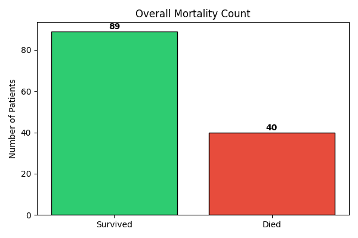 | 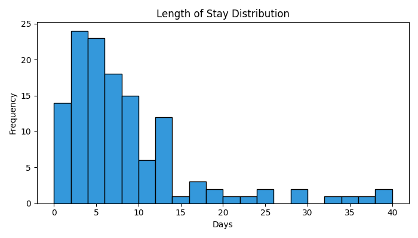 |

| Age Distribution | Admission Type |
|---|---|
| 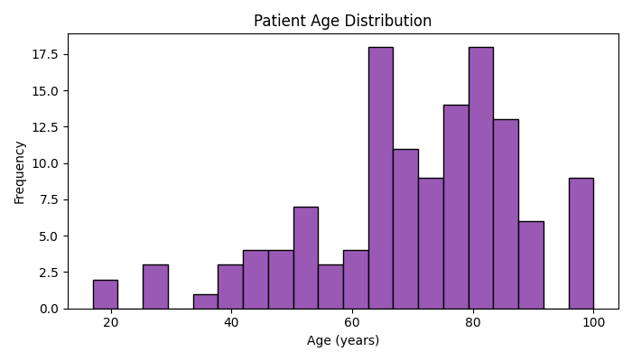 | 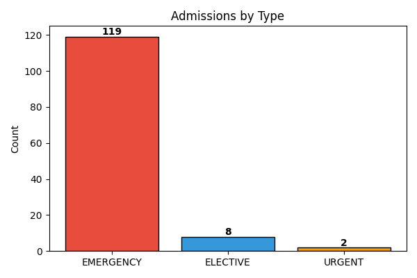 |

| Abnormal vs Mortality | Insurance Mortality |
|---|---|
| 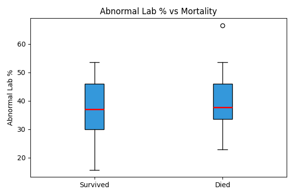 | 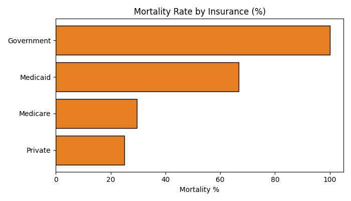 |

| Confusion Matrix | Model Comparison |
|---|---|
| 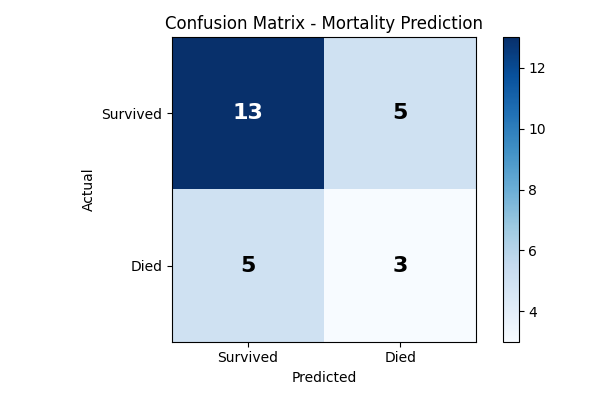 | 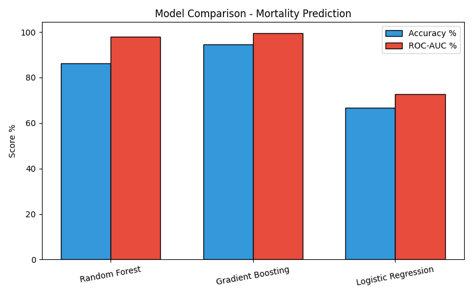 |
# 📊 Power BI Dashboard Preview

## 🏥 Severity Analytics Dashboard

  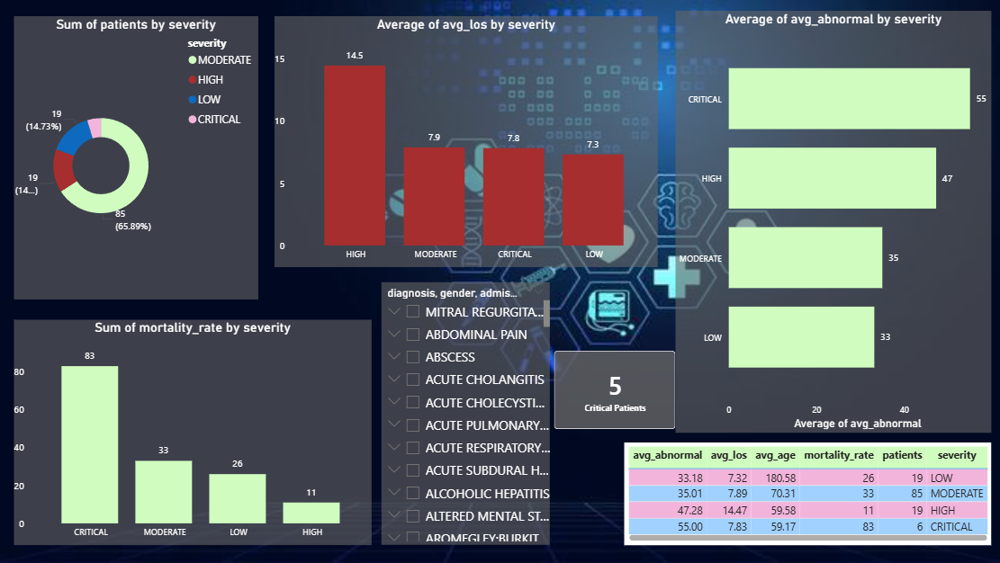

---

## 🧪 Lab Test Analytics Dashboard

  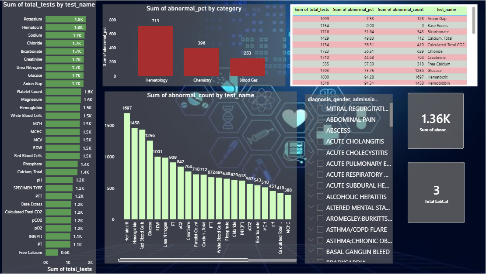

---

## ⏳ Length of Stay (LOS) Dashboard

  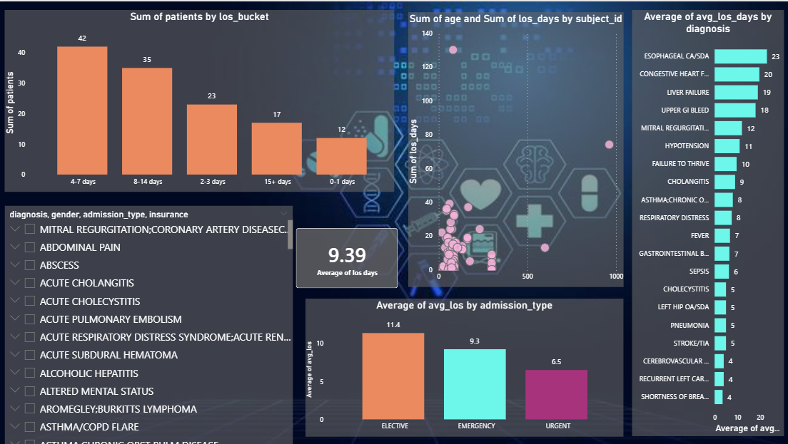

---

## ☠️ Mortality Analysis Dashboard

  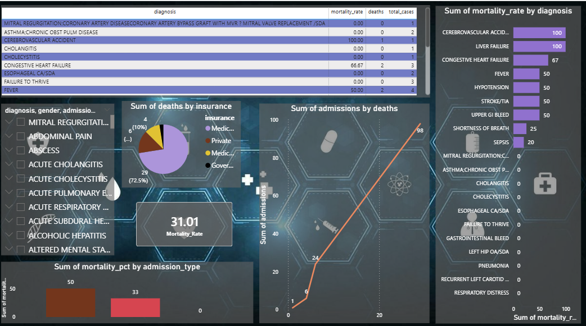

---

## 📋 Admission Analytics Dashboard

  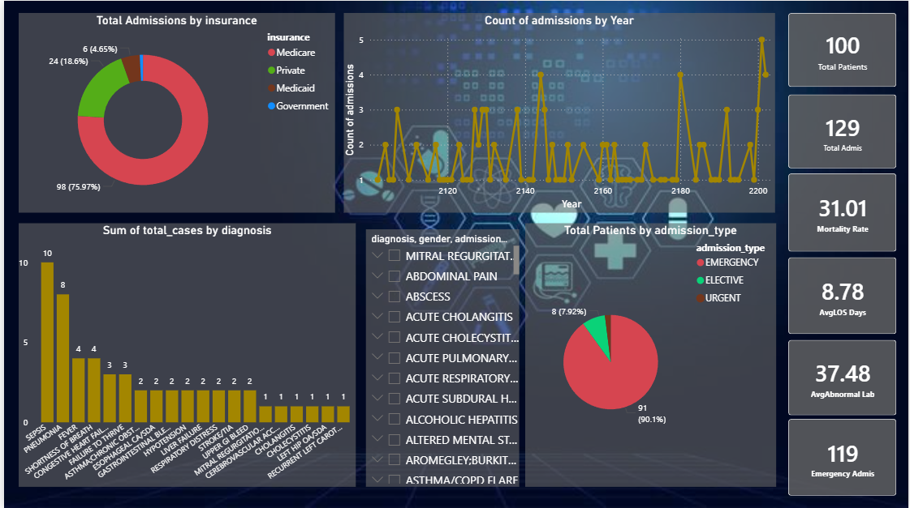

